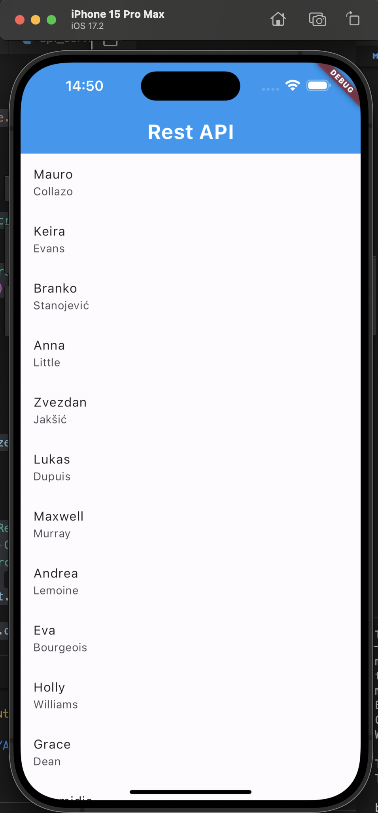

# Rest Api sử dụng Dio

Thêm __Dio__ vào project bằng cách thêm vào file __pubspec.yaml__:

```yaml
dependencies:
  flutter:
    sdk: flutter
  dio: ^5.4.3+1
```

Sử dụng __Dio__ để tạo các yêu cầu tới API. Ví dụ ta có thể tạo một class ApiService để quản lý các yêu cầu API:

```dart
import 'package:dio/dio.dart';

class ApiService {
  final Dio _dio = Dio();

  Future<Response> fetchData() async {
    try {
      return await _dio.get('https://randomuser.me/api/?results=1000');
    } catch (error) {
      rethrow;
    }
  }
}
```

Có thể thêm các phương thức khác cho yêu cầu API khác (put, post, delete,... Ở phía trên là get).

Sau đó, ta sẽ sử dụng FutureBuilder để xử lý yêu cầu API.

```dart
import 'package:dio/dio.dart';
import 'package:flutter/material.dart';
import 'package:rest_api_flutter/api_service.dart';

class HomeScreen extends StatefulWidget {
  const HomeScreen({super.key});

  @override
  State<HomeScreen> createState() => _HomeScreenState();
}

class _HomeScreenState extends State<HomeScreen> {
  final ApiService apiService = ApiService();
  List<dynamic> users = [];

  @override
  Widget build(BuildContext context) {
    return Scaffold(
        appBar: AppBar(
          title: const Text('Rest API'),
          titleTextStyle: const TextStyle(
              color: Colors.white, fontSize: 26, fontWeight: FontWeight.bold),
          backgroundColor: Colors.blue,
        ),
        body: FutureBuilder(
          future: apiService.fetchData(),
          builder: (context, AsyncSnapshot<Response> snapshot) {
            if (snapshot.connectionState == ConnectionState.waiting) {
              return const Center(child: CircularProgressIndicator());
            } else if (snapshot.hasError) {
              return Text('Error: ${snapshot.error}');
            } else {
              final responseData = snapshot.data!.data;
              return ListView.builder(
                  itemCount: responseData['results'].length,
                  itemBuilder: (context, index) {
                    final user = responseData['results'][index];
                    return ListTile(
                        title: Text(user['name']['first']),
                        subtitle: Text(user['name']['last']));
                  });
            }
          },
        ));
  }
}
```

Ta sẽ dùng câu lệnh rẽ nhánh để kiểm tra dữ liệu nhận về, sau đó sẽ xử lý dữ liệu và hiển thị lên ListView chứa các ListTile.

